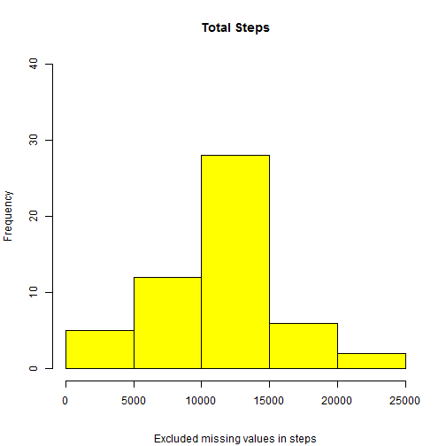
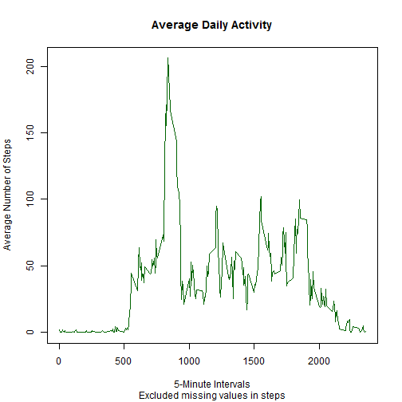
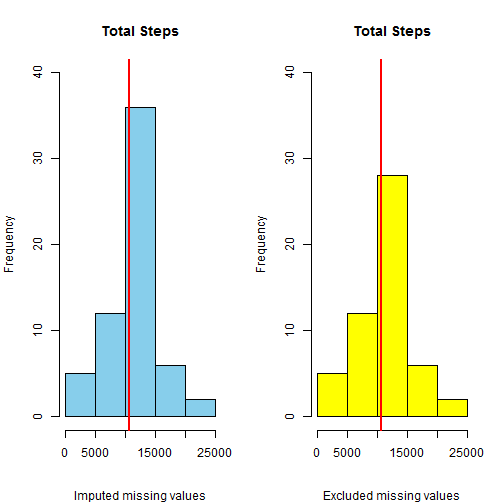
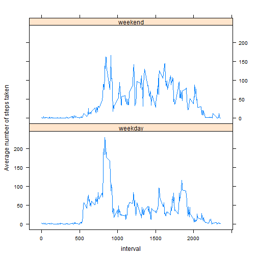

## Dolores Kalayta   

## Loading and preprocessing the data
Two datasets are needed to complete this project.  From the summary, we see that the orignal data set contains missing values for the variable steps.  The second data set is a tranform of the original where the rows with missing values are removed.


```r
        # Original dataset
        activity <- read.csv("data/activity.csv", stringsAsFactors=FALSE,  header=TRUE)
        summary(activity)
```

```
##      steps           date              interval   
##  Min.   :  0.0   Length:17568       Min.   :   0  
##  1st Qu.:  0.0   Class :character   1st Qu.: 589  
##  Median :  0.0   Mode  :character   Median :1178  
##  Mean   : 37.4                      Mean   :1178  
##  3rd Qu.: 12.0                      3rd Qu.:1766  
##  Max.   :806.0                      Max.   :2355  
##  NA's   :2304
```

```r
        # Transformed data set 
        activityNoNA <- activity[which(is.na(activity$steps)== FALSE),]
        summary(activityNoNA)
```

```
##      steps           date              interval   
##  Min.   :  0.0   Length:15264       Min.   :   0  
##  1st Qu.:  0.0   Class :character   1st Qu.: 589  
##  Median :  0.0   Mode  :character   Median :1178  
##  Mean   : 37.4                      Mean   :1178  
##  3rd Qu.: 12.0                      3rd Qu.:1766  
##  Max.   :806.0                      Max.   :2355
```

## What is mean total number of steps taken per day?

This is based on the transformed data set where there are no missing values in the steps variable. The following code calculates the total number of steps across all days and plots the histogram:

```r
totalSteps <- aggregate(activityNoNA$steps, by=list(date=activityNoNA$date), FUN = sum )
# histogram of total number of steps (x) taken each day
stepsPlot <- hist(totalSteps$x, main = "Total Steps", ylim = c(0, 40),
                  sub= "Excluded missing values in steps",xlab = " ", col = "Yellow")
```

 

The mean total number of steps taken per day is 10766 and the median is 10765.

```r
mean(totalSteps$x)  # mean number of steps taken per day
```

```
## [1] 10766
```

```r
median(totalSteps$x) # median number of steps taken per day
```

```
## [1] 10765
```

## What is the average daily activity pattern?

Contintue to use the transformed data set. The pattern is best viewed by creating a plot of the average number of steps taken across all days for each 5-minute interval.  First, the average number of steps for each interval is calculated.

```r
        avgSteps <- aggregate(activityNoNA$steps, by=list(interval=activityNoNA$interval), FUN=mean) 
        head(avgSteps)
```

```
##   interval       x
## 1        0 1.71698
## 2        5 0.33962
## 3       10 0.13208
## 4       15 0.15094
## 5       20 0.07547
## 6       25 2.09434
```
The sample results indicate the average number of steps across all days for each specfic 5-minute interval. A day has 288 5-minute intervals. The interval id indicates the interval starting point of the interval in 24-hour clock time, hence

interval | Time

       0 | 12:00 AM       
     500 | 05:00 AM      
    1000 | 10:00 AM      
    1500 | 03:00 PM    
    2000 | 08:00 PM       
    2355 | 11:55 PM


```r
avgStepsPlot <- plot(avgSteps$interval, avgSteps$x, type= 'l', 
                main = "Average Daily Activity", xlab = "5-Minute Intervals", 
                ylab = "Average Number of Steps", 
                col = "Dark Green", sub= "Excluded missing values in steps")
```

 

The 5-minute interval that has the maximum number of steps is interval 0835 with max steps of 206. So the most active time
of day for this individual is 08:35AM.

```r
maxNumSteps <-avgSteps[which(avgSteps$x == max(avgSteps$x)),]
maxNumSteps
```

```
##     interval     x
## 104      835 206.2
```

## Imputing missing values

The original data set contains missing values and is used to impute the missing values. 

Missing values in the dataset may introduce a bias into the calculations or summaries of the data. There are 2304 missing (NA) values in steps and no missing (NA)
values in date.

```r
sum(is.na(activity$steps)) # number of missing values in steps
```

```
## [1] 2304
```

```r
sum (is.na(activity$date)) # number of missing values in date
```

```
## [1] 0
```

This report used the following strategy to impute missing data: 

missing values in steps will be filled with the mean for the 5-minute interval

- calculate the mean of each interval over all days
- merge the datasets on interval 
- replace the NA in steps with the corresponding interval mean

```r
intervalMean <- aggregate(activityNoNA$steps, by=list(m=activityNoNA$interval), FUN=mean)

iSteps <- merge(activity, intervalMean, by.x="interval", by.y="m")

iSteps$steps[is.na(iSteps$steps)] <-  iSteps$x[is.na(iSteps$steps)]
```

The new data set (newActivity) is created by subsetting and excluding the x (mean) variable, then sorting the data set by date.  


```r
newAct <-  subset(iSteps, select = c(steps, date, interval)) 
newActivity <- newAct[order(newAct$date),]
str(newActivity)
```

```
## 'data.frame':	17568 obs. of  3 variables:
##  $ steps   : num  1.717 0.3396 0.1321 0.1509 0.0755 ...
##  $ date    : chr  "2012-10-01" "2012-10-01" "2012-10-01" "2012-10-01" ...
##  $ interval: int  0 5 10 15 20 25 30 35 40 45 ...
```

```r
sum(is.na(newActivity))
```

```
## [1] 0
```
The new (imputed) dataset is equal in number of observations and variables to the original dataset and there are no missing values. 

The following uses the imputed dataset (newActivity) to create the histogram of the total number of steps taken per day. To facilitate the comparison with the histogram of the original data (activity), the plots are placed side-by-side. The mean and median of each dataset is calculated. The median is shown on the histograms. 


```r
totalStepsAct <- aggregate(newActivity$steps, by=list(date=newActivity$date), FUN = sum )

par (mfrow=c(1,2))
stepsPlotAct <- hist(totalStepsAct$x, main = "Total Steps", xlab=" ",
                     ylim = c(0, 40),
                     sub = "Imputed missing values",
                     col = "Sky Blue")
        abline(v=median(totalStepsAct$x), col = "red", lwd=2)

stepsPlot <- hist(totalSteps$x, main = "Total Steps", ylim = c(0, 40),
                  sub= "Excluded missing values",xlab = " ", col = "Yellow")
        abline(v=median(totalSteps$x), col = "red", lwd=2)
```

 

```r
# original data set with missing values in steps 
stepsPlot$counts # frequency count
```

```
## [1]  5 12 28  6  2
```

```r
mean(totalSteps$x) # mean number of steps 
```

```
## [1] 10766
```

```r
median(totalSteps$x) # median number of steps
```

```
## [1] 10765
```

```r
# imputed data set
stepsPlotAct$counts # frequency count 
```

```
## [1]  5 12 36  6  2
```

```r
mean(totalStepsAct$x) # mean number of steps 
```

```
## [1] 10766
```

```r
median(totalStepsAct$x) # median number of steps 
```

```
## [1] 10766
```

```r
# calcuate percent change
(stepsPlotAct$count[(3)] - stepsPlot$counts[(3)]) / stepsPlot$counts[(3)] * 100
```

```
## [1] 28.57
```
Imputing the data has no impact on the mean or the median number of steps taken each day.  There is an 29% increase in the frequency in the 10,000 - 15,000 range of total steps using the imputed data set. 

## Are there differences in activity patterns between weekdays and weekends?

Using the imputed data set, the function weekdays() is used to convert dates to days of the week. It is then necessary to group days into type: "Saturday" and "Sunday" are of type "weekend"" and the remaining days of the week are of type "weekday". The average number steps taken is calculated across all weekday days or weekend days. 

```r
newActivity$weekday <- weekdays(as.Date(newActivity$date, '%Y-%m-%d'))
newActivity$weekday.type <- ifelse(newActivity$weekday == "Sunday" 
                                   | newActivity$weekday == "Saturday", "weekend", "weekday")
newActivity$weekday.type <-factor(newActivity$weekday.type)
```

Using the lattice system, the panel plots are created to compare weekend vs. weekday activity.

```r
data <- aggregate(newActivity$steps, by=list(interval=newActivity$interval, 
                                             type=newActivity$weekday.type), FUN=mean)

library(lattice)
xyplot(x ~interval | type, data, type = "l", layout=c(1,2), ylab = "Average number of steps taken")
```

 

Examining the chart the maximum average number of steps for the week occurs on weekday mornings between 5:00 AM and 10:00 AM. The calculation below establishes the exact interval at 8:35 AM.

```r
data[which(data$x == max(data$x)),]
```

```
##     interval    type     x
## 104      835 weekday 230.4
```

There is another weekday peak of activity between 3:00 PM and 8:00 PM.  Weekend activity levels differ.  The maximum average number of steps on the weekend is below the weekday maximum, but the participant is more active throughout the day from 8:00 AM to 8:00 PM. 
